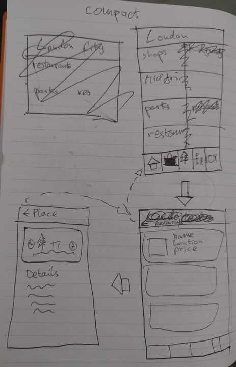
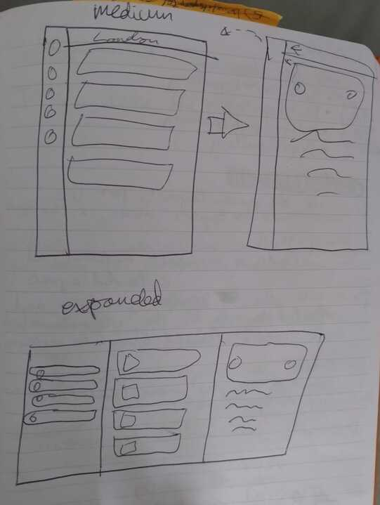

design sketches:
compact widths:

medium and expanded widths:

I started off by making the data models and the data layer.
Then I mad the navigation bars which adapt to the size of the screen,
and navigate to the other destinations.

Now, I am making the places list screen.
It has a view model which is PlacesListScreenStateProducer.
What this screen needs to do is to create its state upon showing on the screen
is fetch all of the recommended places for the category it receives as an argument.
So that is a use case I will need to create.
I haven't designed the screen yet, so I should do that to.
The question is, do I want to make the sue case first, or do I want to design the
place list screen composable first?
Which should I do first? Chat gpt says to start with the underlying data logic
before building out UI components.
Senior engineers I know said they analyse whether they can get the data needed to make the feature
by looking at the UI layer first and figuring out where to get the data,
After this feasibility analysis, one senior engineer then implements the feature as follows:
they start with the data sources in the bottom data layer
and then implement the use cases and UI layer.
another engineer maps the feasibility of the feature they are about to implement in a diagram
for their feasibility study, and then usually implements view and view model first, and the use case
and data layers, but doesn't have a strict rule they follow for order of layer implementation.
So in common both senior engineers have that the plan how they will get the data for implementing
a feature before actually implementing it. 

What I need to do next is make the use case for getting recommended places from
the data sources to the view model.
